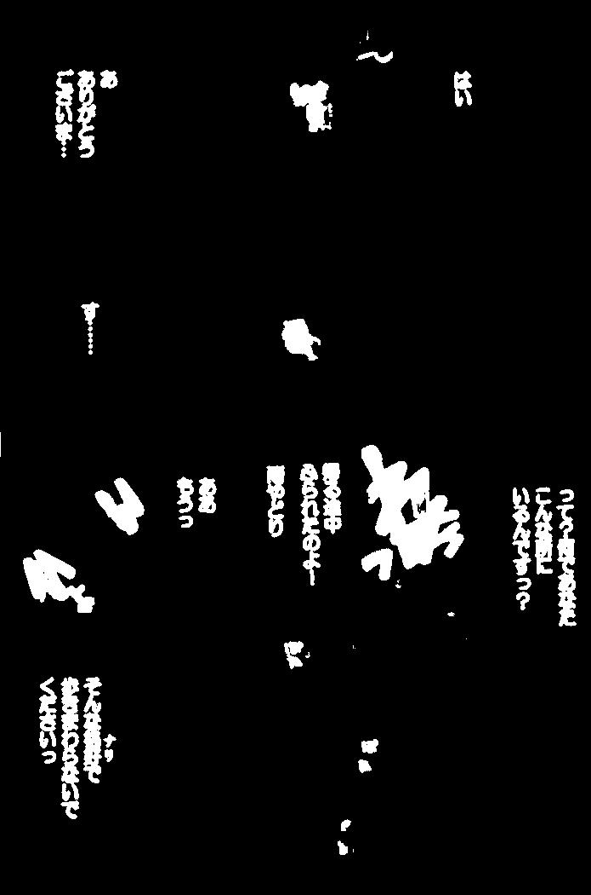
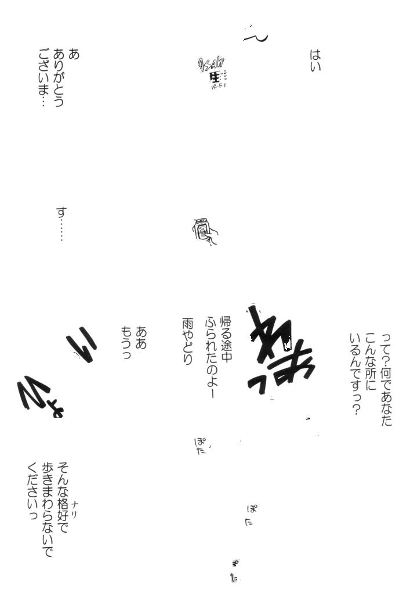
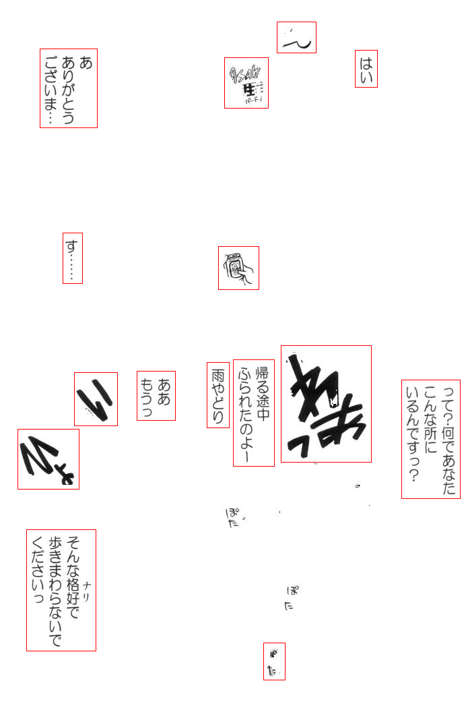
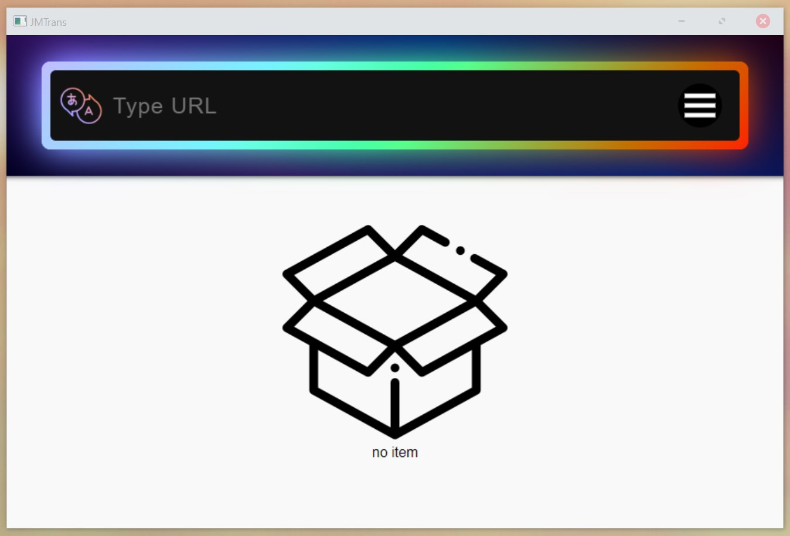

# JMTrans - Japanese Manga Translator
get japanese manga from url to translate manga image using SickZil(text segmentation model), google ocr(or window ocr) and eztrans xp(or google translator)
gui version 0.3v is released. Window ocr and google translate api are now supported.  

download latest version  (using eztrans xp(or google translator), support multi lang)  
https://github.com/ttop32/JMTrans/releases/latest/download/JMTrans.zip
  
pre released colab version  (using google translator only, support multi lang)  
https://colab.research.google.com/drive/1XbR7fNXtT4TGlLI1FBcCQv7Gj5mlDvwb?usp=sharing

# Result

# gui

# Required environment to run  
- google ocr : google drive permission(credential file and scope file)
- window ocr : Microsoft.NET v4.0.30319 and window japanese ocr
- ez trans xp korea translator : ez trans xp program and ehnd 

# How to use  
- open the program and type manga image url then press enter
- It process translation (it takes time)
- it will create zip file on user's window download folder

# Supported URL
gallery-dl is used to download. Its support sites are:
- [supported site list](https://github.com/mikf/gallery-dl/blob/master/docs/supportedsites.rst)

# Workflow
- use gallery-dl to get managa from inputted url 
- do text segmentation from manga image using SickZil
- use opencv contour technique to detect text to crop text image based on text segmentation results
- get text from image using google ocr(or window ocr)
- convert japanese text to translated text using eztrans xp(or google translator)
- use pil to place translated text

# Run python
conda create --name py35 python=3.5  
activate py35   
pip install -r requirements.txt  
python gui.py  

# pip install 
pip install tensorflow-gpu==1.14.0   
pip install requests  
pip install PyQt5  
pip install tqdm funcy opencv-python Pillow  
pip install --upgrade google-api-python-client google-auth-httplib2 google-auth-oauthlib  
pip install --upgrade pyinstaller==3.2.1  
pip install cefpython3  
pip install pywin32  
pip install matplotlib  
pip install imageio  
pip install google_trans_new  
pip install beautifulsoup4  
pip install wget  
pip install pyperclip  
pip install astor==0.8.0  
pip uninstall h5py  

or
conda remove --name py35 --all
conda create --name py35 python=3.5
activate py35
pip install -r requirements.txt
pip freeze > requirements.txt

# Acknowledgement and References
- [gallery-dl](https://github.com/mikf/gallery-dl)  
- [SickZil-Machine](https://github.com/KUR-creative/SickZil-Machine)  
- [Tesseract](https://github.com/tesseract-ocr/tesseract)  
- [Pytesseract](https://pypi.python.org/pypi/pytesseract)  
- [nhocr](https://github.com/fireae/nhocr)  
- [OpenCV with Python wrapper](https://pypi.org/project/opencv-python/)  
- [text-detection](https://github.com/qzane/text-detection)  
- [Google Translate API for Python](https://pypi.org/project/googletrans/)  
- [google translate new](https://github.com/lushan88a/google_trans_new)  
- [ehnd](https://github.com/sokcuri/ehnd)  
- [google drive](https://developers.google.com/drive/api/v3/quickstart/python)  
- [flaticon](https://www.flaticon.com/)  
- [cefpython](https://github.com/cztomczak/cefpython)  

